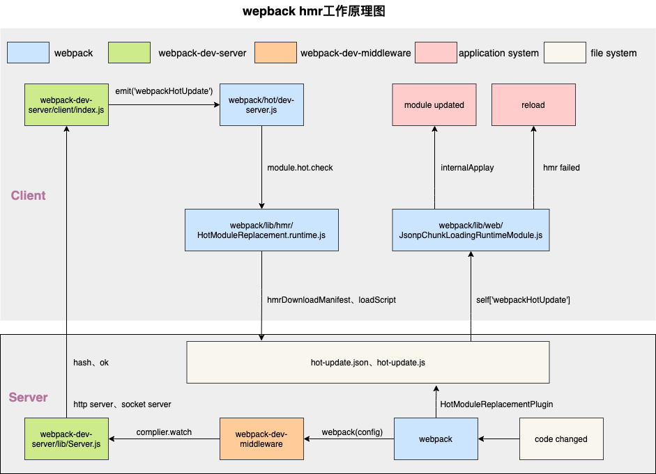

# webpack5之HMR原理探究

## 一、概念介绍
模块热替换(hot module replacement 或 HMR)是 webpack 提供的最有用的功能之一。它允许在运行时更新所有类型的模块，而无需完全刷新。

主要是通过以下几种方式，来显著加快开发速度：

- 保留在完全重新加载页面期间丢失的应用程序状态。
- 只更新变更内容，以节省宝贵的开发时间。
- 在源代码中 CSS/JS 产生修改时，会立刻在浏览器中进行更新，这几乎相当于在浏览器devtools直接更改样式。

注意：HMR只能被应用到开发环境中。

本文示例代码运行环境：
  node:12.20.1、webpack:5.37.1、webpack-cli:4.7.0、webpack-dev-server:3.11.2。
## 二、使用方式
1. 更新webpack.config.js配置。
```javascript
+ devServer: {
  + port: 9000,
  + host: '127.0.0.1',
  + hot: true,
+ },
plugins: [
  // 定义了devServer.hot:true后，可以省略不写，详细原因可以查看本文四、源码分析 1.1 -> webpack-dev-server/lib/utils/addEntries.js 的代码
  // new webpack.HotModuleReplacementPlugin()
] 
```
2. package.json添加scripts。

webpack-cli提供了三个启动webpack-dev-server命令：webpack serve、webpack s、webpack server，它们的作用是相同的。详细原因可以查看本文四、源码分析 -> webpack-cli/lib/webpack-cli.js的代码。
```javascript
"scripts": {
  + "dev": "webpack serve",
}
```
3. 在index.js中新增module.hot?.accept方法。

```javascript
function render() {
  root.innerHTML = require('./print.js')
}
render()

+ module.hot?.accept(['./print.js'], render)
```

4. 修改print.js。

```javascript
 function printMe() {
  - console.log('Updating print.js');
  + console.log('Updating print.js 1');
 }

 module.exports = printMe

```
## 三、源码调试
1. package.json中增加scripts。
```javascript
"scripts": {
  + "debug": "node ./node_modules/.bin/webpack serve"
}
```
2. vscode中打开debug面板，新建一个launch.json配置，启动debug。
```javascript
{
  "version": "0.2.0",
  "configurations": [
    {
      "type": "node",
      "request": "launch",
      "name": "debug",
      "runtimeExecutable": "npm",
      "runtimeArgs": [
        "run-script",
        "debug"
      ],
      "skipFiles": [
        "<node_internals>/**"
      ],
      // cwd设置为需要调试项目的根目录
      "cwd": "${workspaceFolder}/webpack/hmr/test"
    }
  ]
}
```
## 四、源码分析
以下内容主要是以执行webpack serve命令后，各个模块（文件）主要做了什么事情，来展开阐述。

webpack serve
-> ./node_modules/./bin/webpack中runCli (line 48)
```javascript
const runCli = cli => {
  const pkg = require('webpack-cli/package.json');
	require('webpack-cli/bin/cli.js');
};
```
-> webpack-cli/bin/cli.js (line 25)
```javascript
  runCLI(process.argv);
```
-> webpack-cli/lib/bootstrap.js (line 4)
```javascript
  const cli = new WebpackCLI();
  await cli.run(args);
```
-> webpack-cli/lib/webpack-cli.js (line 783)
```javascript
  const externalBuiltInCommandsInfo = [
    {
      name: 'serve [entries...]',
      alias: ['server', 's'],
      pkg: '@webpack-cli/serve',
    }]
  const loadCommandByName = async (commandName) => {
    require(pkg);
  }
  this.webpack = require('webpack');
  // line 1834
  createCompiler(options, callback) {
    let compiler = this.webpack(options}
    return compiler;
  }
```
-> @webpack-cli/serve/index.js (line 6)
```javascript
  const startDevServer_1 = __importDefault(require("./startDevServer"));
  // line 81
  const compiler = await cli.createCompiler();
  await startDevServer_1.default(compiler);
```
-> @webpack-cli/serve/startDevServer.js (line 92)
```javascript
  Server = require('webpack-dev-server/lib/Server');
  const server = new Server(compiler, options);
  server.listen(options.port, options.host, (error) => {
      if (error) {
          throw error;
      }
  });
```
-> webpack-dev-server/lib/Server.js (line 92)
```javascript
  // 修改entry和plugins line 72
  updateCompiler(this.compiler, this.options);
  // 监听compiler.hooks.done line 182
  const { done } = compiler.hooks;
  done.tap('webpack-dev-server', (stats) => {
    this._sendStats(this.sockets, this.getStats(stats));
    this._stats = stats;
  });
  // 实例化express line 168
  this.app = new express();
  // 调用webpack-dev-middleware line 207
  webpackDevMiddleware(
    this.compiler,
    Object.assign({}, this.options, { logLevel: this.log.options.level })
  );
  // 创建http server line 688
  this.listeningApp = http.createServer(this.app);
  // 设置http listen line 774
  listen(port, hostname, fn) {
    this.hostname = hostname;
    return this.listeningApp.listen(port, hostname, (err) => {
      // 创建socket server
      this.createSocketServer();
    });
  }
  // 实例化socket server line 696
  createSocketServer() {
    const SocketServerImplementation = this.socketServerImplementation;
    this.socketServer = new SocketServerImplementation(this);
    this.socketServer.onConnection((connection, headers) => {
      if (!connection) {
        return;
      }
      this.sockets.push(connection);
      if (this.hot) {
        // 告诉client端，热更新服务启动完毕
        this.sockWrite([connection], 'hot');
      }
    });
  }
```
1 -> webpack-dev-server/lib/utils/updateCompliler.js (line 48)
```javascript
  addEntries(webpackConfig, options);
  compilers.forEach((compiler) => {
    const config = compiler.options;
    // 使entry修改生效
    compiler.hooks.entryOption.call(config.context, config.entry);
    // 使plugins修改生效
    providePlugin.apply(compiler);
  });
```
1.1 -> webpack-dev-server/lib/utils/addEntries.js (line 142)
```javascript
  // config.entry增加webpack-dev-server/client/index.js line 39
  const clientEntry = `${require.resolve(
      '../../client/'
    )}?${domain}${sockHost}${sockPath}${sockPort}`;
  // config.entry增加webpack/hot/dev-server.js line 49
  hotEntry = require.resolve('webpack/hot/dev-server');
  config.entry = prependEntry(config.entry || './src', additionalEntries);
  // devServer.hot: true会自动添加HotModuleReplacementPlugin插件 line 153
  config.plugins.push(new webpack.HotModuleReplacementPlugin());
```
1.1.1 -> webpack-dev-server/client/index.js (line 176)

代码会被打包进app.bundle.js中，在client端内实例化websocket,用来和server端的ws服务建立连接，以便接收webpack每次编译的最新变化。
```javascript
  var onSocketMessage = {
    // client端接收server端发送hot指定，开启HMR模式 line 46
    hot: function hot() {
      options.hot = true;
      log.info('[WDS] Hot Module Replacement enabled.');
    },
    // 接收webpack每次编译的最新hash line 63
    hash: function hash(_hash) {
      status.currentHash = _hash;
    },
    // 编译完成 line 107
    ok: function ok() {
      // 第一次编译不用reloadApp
      if (options.initial) {
        return options.initial = false;
      }
      reloadApp(options, status);
    },
  }
  // client端建立webSocket连接, 有sockjs、websocket、path三种类型 line 176
  socket(socketUrl, onSocketMessage);
```
1.1.2 -> webpack-dev-server/client/utils/reloadApp.js (line 23)
```javascript
  // 触发webpackHotUpdate事件 line 23
  var hotEmitter = require('webpack/hot/emitter');
  hotEmitter.emit('webpackHotUpdate', currentHash);
```
1.2.1 -> webpack/hot/dev-server.js (line 23)

代码会被打包进app.bundle.js中，设置webpackHotUpdate事件监听，在webpackHotUpdate事件被触发时执行热更新检查check。
```javascript
  // 触发webpackHotUpdate事件 line 23
  var hotEmitter = require("./emitter");
	hotEmitter.on("webpackHotUpdate", function (currentHash) {
		lastHash = currentHash;
		if (!upToDate() && module.hot.status() === "idle") {
			log("info", "[HMR] Checking for updates on the server...");
			check();
		}
	});
  // 触发module.hot.check() line 12
  var check = function check() {
		module.hot
			.check(true)
			.then(function (updatedModules) {
				if (!updatedModules) {
					window.location.reload();
					return;
				}
			});
	};
```
2 -> webpack-dev-server/lib/utils/getSocketServerImplementation.js (line 3)
```javascript
  // 提供sockjs、ws、path三种类型的socket服务
  if (options.transportMode.server === 'sockjs') {
    ServerImplementation = require('../servers/SockJSServer');
  } else if (options.transportMode.server === 'ws') {
    ServerImplementation = require('../servers/WebsocketServer');
  } else {
    try {
      // eslint-disable-next-line import/no-dynamic-require
      ServerImplementation = require(options.transportMode.server);
    } catch (e) {
      serverImplFound = false;
    }
  }
```
2.1 -> webpack-dev-server/lib/servers/WebsocketServer.js (line 12)
```javascript
  // 实例化ws服务
  this.wsServer = new ws.Server({
    noServer: true,
    path: this.server.sockPath,
  });
  // http server被client访问后，ws server触发connection事件 line 17
  this.server.listeningApp.on('upgrade', (req, sock, head) => {
    
    this.wsServer.handleUpgrade(req, sock, head, (connection) => {
      this.wsServer.emit('connection', connection, req);
    });
  });
```
3 -> webpack-dev-middleware/index.js (line 67)
```javascript
  // 开启watching模式编译 line 41
  context.watching = compiler.watch(options.watchOptions, (err) => {
    if (err) {
      context.log.error(err.stack || err);
      if (err.details) {
        context.log.error(err.details);
      }
    }
  });
  // 设置文件系统 line 65
  setFs(context, compiler);
  // 提供静态资源服务 line 67
  middleware(context)
```
3.1 -> webpack-dev-middleware/middleware.js (line 96)
```javascript
  // server content line 96
  let content = context.fs.readFileSync(filename);
  res.setHeader('Content-Type', contentType);
  res.statusCode = res.statusCode || 200;
  if (res.send) {
    res.send(content);
  } else {
    res.end(content);
  }
```
3.2 -> compiler.watch首次编译生成dist/app.bundle.js
```javascript
  // 拦截__webpack_require__请求，重写require请求，在module上新增hot、parents、children属性 webpack/lib/hmr/HotModuleReplacement.runtime.js line 39
  __webpack_require__.i.push(function (options) {
    var module = options.module;
    var require = createRequire(options.require, options.id);
    module.hot = createModuleHotObject(options.id, module);
    module.parents = currentParents;
    module.children = [];
    currentParents = [];
    options.require = require;
  });
  // 收集模块间的依赖关系，存放在模块的parents、children属性里 webpack/lib/hmr/HotModuleReplacement.runtime.js line 52
  function createRequire(require, moduleId) {
    var me = installedModules[moduleId];
    if (!me) return require;
    var fn = function (request) {
      if (me.hot.active) {
        if (installedModules[request]) {
          var parents = installedModules[request].parents;
          if (parents.indexOf(moduleId) === -1) {
            parents.push(moduleId);
          }
        } else {
          currentParents = [moduleId];
          currentChildModule = request;
        }
        if (me.children.indexOf(request) === -1) {
          me.children.push(request);
        }
      } else {
        currentParents = [];
      }
      return require(request);
    };
    return fn;
  }
  // 创建module.hot对象 webpack/lib/hmr/HotModuleReplacement.runtime.js line 103
  function createModuleHotObject(moduleId, me) {
    var hot = {
      _acceptedDependencies: {}, // 收集module.hot.accept依赖
      active: true,
      accept: function (dep, callback, errorHandler) {
        if (dep === undefined) hot._selfAccepted = true;
        else if (typeof dep === "function") hot._selfAccepted = dep;
        else if (typeof dep === "object" && dep !== null) {
          for (var i = 0; i < dep.length; i++) {
            hot._acceptedDependencies[dep[i]] = callback || function () { };
          }
        } else {
          hot._acceptedDependencies[dep] = callback || function () { };
        }
      },
      check: hotCheck,
      apply: hotApply,
    };
    return hot;
  }
  // 开启热更新检查 webpack/lib/hmr/HotModuleReplacement.runtime.js line 242
  function hotCheck(applyOnUpdate) {
    // __webpack_require__.hmrM = hmrDownloadManifest, fetch请求app.[hash].hot-update.json文件
    return __webpack_require__.hmrM().then(function (update) {
      var updatedModules = [];
      currentUpdateApplyHandlers = [];
      return Promise.all(
        Object.keys(__webpack_require__.hmrC).reduce(function (
          promises,
          key
        ) {
          // __webpack_require__.hmrC = hmrDownloadUpdateHandlers,  创建script标签，用jsonp的方式去加载app.[hash].hot-update.js文件
          __webpack_require__.hmrC[key](
            update.c,
            update.r,
            update.m,
            promises,
            // 收集applyHandlers
            currentUpdateApplyHandlers,
            updatedModules
          );
          return promises;
        },
          [])
      ).then(function () {
        return waitForBlockingPromises(function () {
          if (applyOnUpdate) {
            // 触发applyHandlers
            return internalApply(applyOnUpdate);
          }
        });
      });
    });
  }
  // fetch请求app.[hash].hot-update.json文件
  __webpack_require__.hmrM = () => {
    if (typeof fetch === "undefined") throw new Error("No browser support: need fetch API");
    return fetch(__webpack_require__.p + __webpack_require__.hmrF()).then((response) => {
      if (response.status === 404) return;
      if (!response.ok) throw new Error("Failed to fetch update manifest " + response.statusText);
      return response.json();
    });
  };
  __webpack_require__.hmrC.jsonp = function (
    chunkIds,
    removedChunks,
    removedModules,
    promises,
    applyHandlers,
    updatedModulesList
  ) {
    // 收集加载app.[hash].hot-update.js文件后的处理方法
    applyHandlers.push(applyHandler);
    chunkIds.forEach(function (chunkId) {
      if (
        __webpack_require__.o(installedChunks, chunkId) &&
        installedChunks[chunkId] !== undefined
      ) {
        // 创建jsonp任务
        promises.push(loadUpdateChunk(chunkId, updatedModulesList));
      }
    });
  };
  // 触发module.hot._acceptedDependencies   webpack/lib/hmr/JavascriptHotModuleReplacement.runtime.js line 24
  function applyHandler(options) {
    var moduleOutdatedDependencies;
    return {
      apply: function (reportError) {
        for (var outdatedModuleId in outdatedDependencies) {
          if (__webpack_require__.o(outdatedDependencies, outdatedModuleId)) {
            var module = __webpack_require__.c[outdatedModuleId];
            if (module) {
              moduleOutdatedDependencies =
                outdatedDependencies[outdatedModuleId];
              for (var j = 0; j < moduleOutdatedDependencies.length; j++) {
                var dependency = moduleOutdatedDependencies[j];
                var acceptCallback =
                  // 清空module.hot._acceptedDependencies中的方法
                  module.hot._acceptedDependencies[dependency];
              }
            }
          }
        }
        return outdatedModules;
      }
    };
  }
  // 拼接jsonp请求app.[hash].hot-update.js路径
  function loadUpdateChunk(chunkId) {
    return new Promise((resolve, reject) => {
      var url = __webpack_require__.p + __webpack_require__.hu(chunkId);
      __webpack_require__.l(url, loadingEnded);
    });
  }
  // 创建script标签来加载js文件
  __webpack_require__.l = (url, done, key, chunkId) => {
    var script, needAttach;
    if (!script) {
      needAttach = true;
      script = document.createElement('script');
      script.charset = 'utf-8';
      script.timeout = 120;
      script.src = url;
    }
    needAttach && document.head.appendChild(script);
  };
  // 定义self["webpackHotUpdate"]方法，用currentUpdate来收集需要热更新模块的模块 webpack/lib/web/JsonpChunkLoadingRuntimeModule.js line 303
  self["webpackHotUpdate"] = (chunkId, moreModules, runtime) => {
    for (var moduleId in moreModules) {
      if (__webpack_require__.o(moreModules, moduleId)) {
        currentUpdate[moduleId] = moreModules[moduleId];
        if (currentUpdatedModulesList) currentUpdatedModulesList.push(moduleId);
      }
    }
  };
  // 使用需要热更新的模块  webpack/lib/hmr/HotModuleReplacement.runtime.js line 298
  function internalApply(options) {
    var results = currentUpdateApplyHandlers.map(function (handler) {
      return handler(options);
    });
    results.forEach(function (result) {
      if (result.apply) {
        // 调用applyHandler.apply()
        var modules = result.apply(reportError);
      }
    });
  }
```
3.3 -> compiler.watch重新编译,由webpack.HotModuleReplacementPlugin生成dist/app.[hash].hot-update.json
```javascript
  // c为需要替换的chunkIds
  {"c":["app"],"r":[],"m":[]}
```
3.4 -> compiler.watch重新编译,由webpack.HotModuleReplacementPlugin生成dist/app.[hash].hot-update.js
```javascript
  // 调用self["webpackHotUpdate"](chunkId, moreUpdates)
  self["webpackHotUpdate"]("app", {
    "./src/print.js":
      ((module) => {
        function printMe() {
          console.log('Updating print.js.3');
        }
        module.exports = printMe
      })
  },
    function (__webpack_require__) {
      "use strict";
      (() => {
        // 为每次编译最新的hash
        __webpack_require__.h = () => ("4bbb5237e2809cf139b2")
      })();
    }
  );
```
## 五、工作原理
### HMR工作流程分析
webpack监听到项目中文件或者模块的代码有修改后，由webpack.HotModuleReplacementPlugin插件生成hot-update.json和hot-update.js补丁文件，然后客户端通过socket连接得到补丁文件，最后由
HMR runtime将补丁文件的内容应用到模块系统中。
### HMR工作原理图

上图展示了从我们修改代码，到模块热更新完成的一个 HMR 完整工作流程，图中已用箭头将流程标识出来。

1. webpack-dev-server提供http server服务和socket server服务，在webpack-dev-middleware中间件中启用webpack的watch模式。
2. 当文件系统中某一个文件发生修改，webpack 监听到文件变化，根据配置文件对模块重新编译打包，并将打包后的代码保存在文件系统中。
3. webpack-dev-server/client/index.js在浏览器端和服务端之间建立一个 websocket长连接，将webpack编译打包的状态信息告知浏览器端。
4. 浏览器端通过webpack/hot/dev-server.js接收到最新的编译信息，从而触发module.hot.check方法来开始热更新检查。
5. 执行webpack/lib/hmr/HotModuleReplacement.runtime.js中的hotCheck方法，通过hmrDownloadManifest以fetch方式请求hot-update.json文件，然后执行loadScript以jsonp的方式加载hot-update.js文件。
6. 执行hot-update.js文件中的self['webpackHotUpdate']方法，在webpack/lib/web/JsonpChunkLoadingRuntimeModule.js文件的self['webpackHotUpdate']方法定义中去收集到需要更新的模块依赖。
7. 调用internalApply方法，用新模块替换掉旧模块，然后执行module.hot.__acceptedDependencies中的回调函数，从而实现模块替换的效果。

## 六、源码实现

[代码地址](https://github.com/yanglei00/publish/tree/master/webpack/hmr/test)

页面访问地址：http://127.0.0.1:9001/hmr.html

已实现相应功能的模块列表：
+ @webpack-cli/serve/lib/index.js  启动服务
+ webpack-dev-server/lib/Server.js 设置http和socket服务监听
+ webpack-dev-server/client/index.js 提供websocket连接
+ webpack/hot/dev-server.js 触发module.hot.check
+ webpack-dev-middleware/index.js 启用compiler.watch()和提供静态资源服务
+ static/hmr.js 收集模块依赖、下载hot-update.json、hot-update、js文件，执行模块热替换

## 七、总结
本文和大家主要分享Webpack的HMR源码分析和工作原理，在工作原理分析中，通过一张“webpack hmr工作原理图”图让大家对HMR整个工作流程有所了解，HMR本身源码内容较多，许多细节之处本文没有完整写出，需要各位读者自己慢慢阅读和理解源码。

## 参考文章
1.[官方文档](https://webpack.docschina.org/guides/hot-module-replacement/#enabling-hmr)
